# Sri Lanka Police – Tuk-Tuk Tracking API

> **NB6007CEM Web API Development**

Real-Time Three-Wheeler (Tuk-Tuk) Tracking & Movement Logging System for Sri Lanka Law Enforcement.

## How to use

```bash
# 1. Install dependencies
npm install

# 2. Seed the database (9 provinces, 25 districts, 25 stations, 210 vehicles, 1-week history)
npm run seed

# 3. Start the API server
npm start

# 4. (Optional) Run GPS simulation
npm run simulate
```

API runs at: http://localhost:3000  
Swagger Docs: http://localhost:3000/api-docs

## Default Creds

| Role       | Username         | Password     |
|------------|------------------|--------------|
| ADMIN      | admin            | Admin@1234   |
| PROVINCIAL | wp_officer       | Admin@1234   |
| DISTRICT   | cmb_officer      | Admin@1234   |
| DEVICE     | device_dev-0001  | Device@5678  |

## Key Endpoints

| Method | Endpoint                          | Description                      |
|--------|-----------------------------------|----------------------------------|
| POST   | /api/v1/auth/login                | Login (get JWT)                  |
| GET    | /api/v1/vehicles/:id/location     | 🔴 Live last-known location       |
| GET    | /api/v1/vehicles/:id/history      | 📍 Movement log (time window)     |
| GET    | /api/v1/locations/live            | 🗺 Live dashboard (all vehicles)  |
| POST   | /api/v1/locations                 | 📡 GPS device push               |
| GET    | /api/v1/vehicles?provinceId=xxx   | Province-filtered vehicle list    |
| GET    | /api/v1/vehicles?districtId=xxx   | District-filtered vehicle list    |

## System Architecture

```
GPS Device → POST /api/v1/locations (DEVICE token)
                        ↓
              [Location Store / NeDB]
                        ↓
Police Officer → GET /api/v1/vehicles/:id/location   (live)
              → GET /api/v1/vehicles/:id/history     (history)
              → GET /api/v1/locations/live           (dashboard)
```

## Role-Based Access

| Role       | Scope              | Can Push Pings | Can View Vehicles |
|------------|--------------------|----------------|-------------------|
| ADMIN      | All                | Yes            | All               |
| PROVINCIAL | Own Province       | No             | Province          |
| DISTRICT   | Own District       | No             | District          |
| DEVICE     | Own Vehicle        | Yes (own only) | No                |

## Project Structure

```
src/
├── app.js                  — Express entry point
├── config/
│   ├── database.js         — NeDB async wrapper
│   └── swagger.js          — OpenAPI 3.0 spec
├── middleware/
│   ├── auth.js             — JWT + RBAC middleware
│   └── response.js         — Standard response helpers
├── controllers/
│   ├── authController.js
│   ├── geoController.js    — Provinces + Districts
│   ├── stationController.js
│   ├── vehicleController.js
│   ├── driverController.js
│   ├── locationController.js
│   └── userController.js
├── routes/
│   └── index.js
└── data/
    └── seed.js             — Seed script

scripts/
└── simulate.js             — GPS live simulation CLI
```

## Live Deployment
- **API Service**: https://167.172.2.149.nip.io/
- **Health Check**: https://167.172.2.149.nip.io/api/v1/health

```mermaid
flowchart TD
    %% ── EXTERNAL CLIENTS ──────────────────────────────────────────
    subgraph CLIENTS["🌐 External Clients"]
        GPS["📡 GPS Device\n(Tuk-Tuk Tracker)\nDEVICE token\nPOST /locations"]
        HQ["🖥️ HQ Dashboard\nADMIN token\nFull access"]
        PROV["👮 Provincial Officer\nPROVINCIAL token\nProvince-scoped"]
        DIST["👮 District Officer\nDISTRICT token\nDistrict-scoped"]
    end

    %% ── DNS RESOLUTION ────────────────────────────────────────────
    subgraph DNS["🔍 DNS Resolution — nip.io"]
        NIPIO["167.172.2.149.nip.io\nFree wildcard DNS service\nNo signup required\nAutomatically resolves\nsubdomain → embedded IP\n167.172.2.149.nip.io ➜ 167.172.2.149"]
    end

    %% ── TLS ───────────────────────────────────────────────────────
    subgraph TLS_LAYER["🔒 TLS — Let's Encrypt"]
        CERT["SSL/TLS Certificate\nIssued by Let's Encrypt CA\nTrusted by all browsers\nValid for 90 days\nAuto-renewed by certbot\nTLSv1.2 + TLSv1.3 only\nWeak ciphers disabled"]
    end

    %% ── DIGITALOCEAN DROPLET ──────────────────────────────────────
    subgraph DROPLET["☁️ DigitalOcean Droplet — 167.172.2.149 (Ubuntu 24.04)"]

        subgraph UFW["🛡️ UFW Firewall"]
            FW["Allow: 22 SSH\nAllow: 80 HTTP\nAllow: 443 HTTPS\nDeny: all other ports\nNode.js port 3000\nnever exposed"]
        end

        subgraph NGINX["⚙️ nginx — Reverse Proxy"]
            HTTP_REDIR["Port 80 Listener\nForce redirect\nHTTP → HTTPS 301"]
            HTTPS_SRV["Port 443 Listener\nTLS Termination\nDecrypts HTTPS\nForwards plain HTTP\nto 127.0.0.1:3000"]
            SEC_HDR["Security Headers\nHSTS max-age=31536000\nX-Frame-Options: DENY\nX-Content-Type-Options\nContent-Security-Policy\nReferrer-Policy\nserver_tokens off"]
            RATE["Rate Limiting\n/auth/ → 5 req/min\n/locations → 1 req/sec\nAll others → 10 req/sec\nReturns 429 on breach"]
            PROXY["Proxy Pass\nX-Real-IP forwarded\nX-Request-ID injected\nHost header preserved\nKeepAlive to Node.js"]
        end

        subgraph PM2["🔄 PM2 Process Manager"]
            PM2_MGR["Keeps Node.js alive\nAuto-restart on crash\nStartup on server reboot\npm2 logs for monitoring"]
        end

        subgraph NODEJS["🟢 Node.js API — 127.0.0.1:3000"]

            subgraph MW["Middleware Stack"]
                HELMET["helmet\nHTTP security headers"]
                CORS_MW["cors\nOrigin whitelist"]
                HPP_MW["hpp\nParam pollution block"]
                MORGAN["morgan\nStructured access logs"]
                RL["express-rate-limit\nDefence in depth"]
                REQID["X-Request-ID\nRequest correlation"]
            end

            subgraph AUTH_MW["Authentication & Authorisation"]
                JWT_V["JWT Verification\njsonwebtoken\nVerifies Bearer token\nChecks expiry + signature"]
                RBAC["RBAC Middleware\nADMIN → full access\nPROVINCIAL → province scope\nDISTRICT → district scope\nDEVICE → push pings only"]
            end

            subgraph VALIDATION["Input Validation"]
                VAL["express-validator\nAll inputs validated\nNIC format check\nCoordinate bounds\nSri Lanka boundary\n422 on failure"]
            end

            subgraph ROUTES["API Routes — /api/v1"]
                R_AUTH["POST /auth/login\nPOST /auth/register\nGET  /auth/me"]
                R_VEH["GET/POST /vehicles\nGET/PATCH/DELETE /vehicles/:id\nGET /vehicles/:id/location\nGET /vehicles/:id/history"]
                R_LOC["POST /locations\nGET  /locations\nGET  /locations/live"]
                R_GEO["GET/POST /provinces\nGET/POST /districts\nGET/POST /stations"]
                R_DRV["GET/POST /drivers\nGET/PATCH/DELETE /drivers/:id"]
                R_USR["GET/PATCH/DELETE /users\n(ADMIN only)"]
            end

            subgraph MODELS["Data Model Layer"]
                DM["vehicleModel.js\nlocationModel.js\ndomainModels.js\nEntity factories\nPatch builders\nStatus enums\nField whitelisting"]
            end

            subgraph RESOURCES["Resource Model Layer"]
                RM["vehicleResource.js\nresources/index.js\nTransforms DB entity\nto client representation\n_id → id\nhref self-links\nSensitive fields removed\nRole-gated fields\nNested sub-resources"]
            end

            subgraph CONTROLLERS["Controllers"]
                CTRL["authController.js\nvehicleController.js\nlocationController.js\nallControllers.js\nBusiness logic\nJurisdiction scoping\nError delegation"]
            end
        end

        subgraph DB["💾 NeDB — File-based Database"]
            DB_PROV["provinces.db\n9 provinces"]
            DB_DIST["districts.db\n25 districts"]
            DB_STA["stations.db\n25 stations"]
            DB_VEH["vehicles.db\n210 tuk-tuks"]
            DB_DRV["drivers.db\n220 drivers"]
            DB_LOC["locations.db\n250k+ pings\n1 week history"]
            DB_USR["users.db\nADMIN / PROVINCIAL\nDISTRICT / DEVICE"]
        end

    end

    %% ── FLOW CONNECTIONS ──────────────────────────────────────────
    GPS & HQ & PROV & DIST -->|"HTTPS request\nencrypted"| NIPIO
    NIPIO -->|"resolves to\n167.172.2.149"| FW
    CERT -.->|"certificate\ninstalled on"| HTTPS_SRV
    FW -->|port 80| HTTP_REDIR
    FW -->|port 443| HTTPS_SRV
    HTTP_REDIR -->|301 redirect| HTTPS_SRV
    HTTPS_SRV --> SEC_HDR --> RATE --> PROXY
    PROXY -->|"plain HTTP\n127.0.0.1:3000"| MW
    PM2_MGR -->|"manages"| NODEJS
    MW --> AUTH_MW --> VALIDATION --> ROUTES
    ROUTES --> CONTROLLERS
    CONTROLLERS --> MODELS
    MODELS <-->|"read/write\nentities"| DB
    CONTROLLERS --> RESOURCES
    RESOURCES -->|"shaped JSON\nresponse"| PROXY

    %% ── STYLES ────────────────────────────────────────────────────
    classDef clientBox fill:#1e3a5f,stroke:#4a9eff,color:#fff
    classDef dnsBox fill:#1a4a2e,stroke:#4caf50,color:#fff
    classDef tlsBox fill:#4a1a1a,stroke:#ff6b6b,color:#fff
    classDef nginxBox fill:#2d3436,stroke:#fdcb6e,color:#fff
    classDef nodeBox fill:#1a3a2e,stroke:#00b894,color:#fff
    classDef dbBox fill:#2d1b4e,stroke:#a29bfe,color:#fff
    classDef pm2Box fill:#1a2a4a,stroke:#74b9ff,color:#fff
    classDef fwBox fill:#4a2d00,stroke:#e17055,color:#fff

    class GPS,HQ,PROV,DIST clientBox
    class NIPIO dnsBox
    class CERT tlsBox
    class HTTP_REDIR,HTTPS_SRV,SEC_HDR,RATE,PROXY nginxBox
    class MW,AUTH_MW,VALIDATION,ROUTES,MODELS,RESOURCES,CONTROLLERS,HELMET,CORS_MW,HPP_MW,MORGAN,RL,REQID,JWT_V,RBAC,VAL,R_AUTH,R_VEH,R_LOC,R_GEO,R_DRV,R_USR,DM,RM,CTRL nodeBox
    class DB_PROV,DB_DIST,DB_STA,DB_VEH,DB_DRV,DB_LOC,DB_USR dbBox
    class PM2_MGR pm2Box
    class FW fwBox
```

